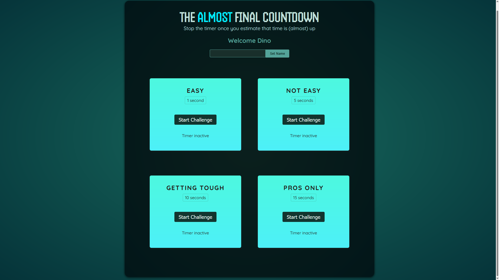
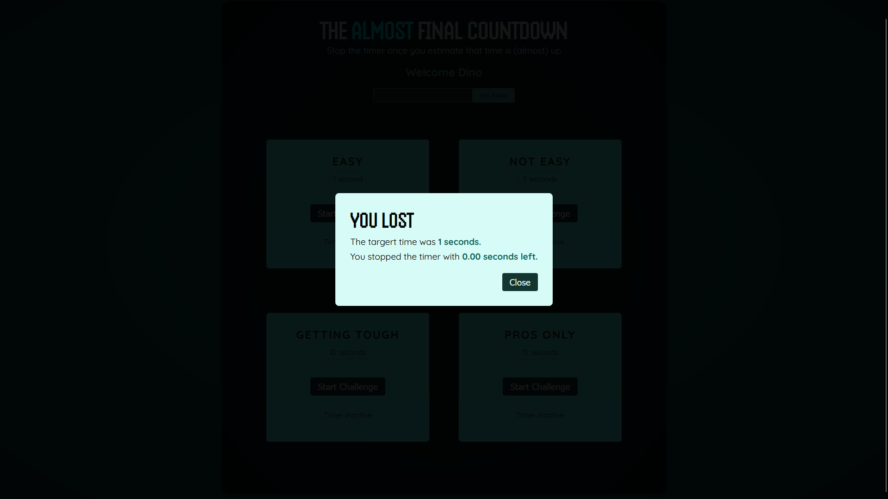
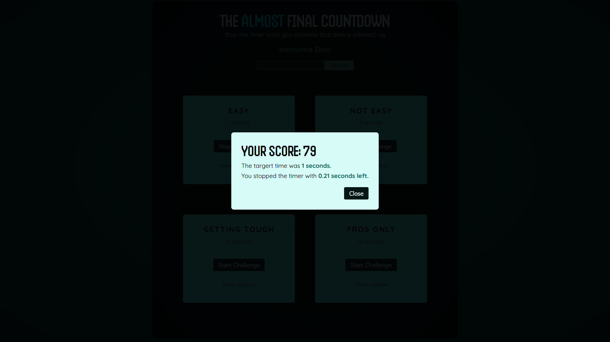

# Timer Challenge Game

Este é um projeto de um jogo de desafios de tempo, onde o jogador deve completar tarefas dentro de um tempo limite.

## Visão Geral

O jogo apresenta desafios com diferentes níveis de dificuldade, cada um com um tempo alvo específico. O jogador pode iniciar e parar o timer, e o resultado é exibido em um modal ao final do desafio. O jogador também pode definir seu nome, que é exibido na interface.

## Como Executar o Projeto

1. **Clone o repositório:**

   ```bash
   git clone https://github.com/FellipeMiguel/react-timer-challenge.git

   cd timer-challenge-game
   ```

2. **Instale as dependências:**

   ```bash
   npm install
   ```

3. **Inicie o servidor de desenvolvimento:**

   ```bash
   npm start
   ```

   Acesse o projeto:
   Abra o navegador e acesse http://localhost:3000.

## Capturas de Tela

Aqui estão algumas imagens do jogo em funcionamento:

### Tela Inicial

  
_Tela inicial do jogo, onde o jogador pode definir seu nome e selecionar o nível de desafio._

### Resultado Vitória

  
_Modal exibindo o resultado do desafio na derrota._

### Resultado Derota

  
_Modal exibindo o resultado do desafio na vitória._
